# WAF Assessment Tool - Architecture & User Flow

## 📐 System Architecture Overview

```mermaid
graph TB
    subgraph "User Layer"
        U1[👤 End User]
        U2[👨‍💼 Admin/DevOps]
        U3[📊 Data Analyst]
    end
    
    subgraph "Databricks Workspace"
        subgraph "Application Layer"
            APP[🚀 Databricks App<br/>Streamlit UI<br/>WAF Guide Sidebar]
            DASH[📊 Lakeview Dashboard<br/>WAF_ASSESSMENTv1.6<br/>4 Pillars + Summary]
        end
        
        subgraph "Data Layer"
            ST1[system.information_schema.tables]
            ST2[system.billing.usage]
            ST3[system.compute.clusters]
            ST4[system.compute.warehouses]
            ST5[system.access.table_lineage]
            ST6[system.query.history]
            ST7[system.mlflow.experiments_latest]
            ST8[system.serving.served_entities]
            ST9[system.data_classification.results]
            ST10[system.access.audit]
        end
        
        subgraph "Compute Layer"
            SQLW[SQL Warehouse<br/>Serverless Starter]
            CLUSTER[Compute Clusters]
        end
        
        subgraph "Storage Layer"
            UC[Unity Catalog<br/>Metastore]
            DELTA[Delta Tables]
        end
    end
    
    subgraph "Deployment Layer"
        DEPLOY[deploy_complete.py<br/>Deployment Script]
        GIT[GitHub Repository<br/>Version Control]
    end
    
    U1 --> APP
    U2 --> APP
    U3 --> APP
    APP --> DASH
    DASH --> SQLW
    SQLW --> ST1
    SQLW --> ST2
    SQLW --> ST3
    SQLW --> ST4
    SQLW --> ST5
    SQLW --> ST6
    SQLW --> ST7
    SQLW --> ST8
    SQLW --> ST9
    SQLW --> ST10
    ST1 --> UC
    ST2 --> UC
    ST3 --> CLUSTER
    ST4 --> SQLW
    DEPLOY --> APP
    DEPLOY --> DASH
    DEPLOY --> GIT
    GIT --> DEPLOY
```



---

## 🔄 Data Flow Architecture

```mermaid
graph LR
    subgraph "Data Sources"
        SYS[System Tables<br/>13+ Tables]
    end
    
    subgraph "Data Processing"
        CTE[Shared CTEs<br/>Common Calculations]
        METRIC[Individual Metrics<br/>Percentage-Based Logic]
        THRESH[Threshold Comparison<br/>Pass/Fail Determination]
    end
    
    subgraph "Dataset Layer"
        TOTAL[total_percentage_[pillar]<br/>Overall Score<br/>1 row]
        CONTROLS[waf_controls_[pillar]<br/>Individual Metrics<br/>N rows]
        PRINCIPLE[waf_principal_percentage_[pillar]<br/>Per-Principle<br/>M rows]
        SUMMARY[total_percentage_across_pillars<br/>All Pillars<br/>4 rows]
    end
    
    subgraph "Visualization Layer"
        WIDGET1[Completion % Gauge]
        WIDGET2[Principle Breakdown Chart]
        WIDGET3[WAF Controls Table]
        WIDGET4[Summary Bar Chart]
    end
    
    SYS --> CTE
    CTE --> METRIC
    METRIC --> THRESH
    THRESH --> TOTAL
    THRESH --> CONTROLS
    THRESH --> PRINCIPLE
    TOTAL --> SUMMARY
    TOTAL --> WIDGET1
    PRINCIPLE --> WIDGET2
    CONTROLS --> WIDGET3
    SUMMARY --> WIDGET4
```

---

## 👤 User Flow - Complete Journey

```mermaid
sequenceDiagram
    participant U as 👤 User
    participant APP as 🚀 Databricks App
    participant DASH as 📊 Dashboard
    participant SQL as SQL Warehouse
    participant ST as System Tables
    participant GUIDE as WAF Guide Sidebar
    
    U->>APP: 1. Opens App URL
    APP->>U: 2. Displays Streamlit UI
    APP->>GUIDE: 3. Loads WAF Guide Sidebar
    
    U->>GUIDE: 4. Selects Pillar (e.g., Reliability)
    GUIDE->>U: 5. Shows Pillar Overview<br/>(Score Calculation Method)
    
    U->>GUIDE: 6. Selects Metric (e.g., R-01-01)
    GUIDE->>U: 7. Shows Detailed Info:<br/>- Calculation Formula<br/>- Threshold<br/>- Actions if Low
    
    U->>DASH: 8. Views Dashboard
    DASH->>SQL: 9. Executes Queries
    SQL->>ST: 10. Queries System Tables
    ST->>SQL: 11. Returns Data
    SQL->>DASH: 12. Returns Results
    DASH->>U: 13. Displays Charts & Tables
    
    U->>DASH: 14. Sees Low Score
    U->>GUIDE: 15. Checks WAF Guide
    GUIDE->>U: 16. Shows Action Steps<br/>(SQL Examples, Best Practices)
    
    U->>U: 17. Implements Recommendations
    U->>DASH: 18. Refreshes Dashboard
    DASH->>U: 19. Sees Improved Score
```



---

## 🏗️ Detailed Component Architecture


---

## 📊 Score Calculation Flow


---

## 🚀 Deployment Architecture

```mermaid
graph TB
    subgraph "Development Environment"
        DEV[Developer Machine<br/>- Local Code<br/>- Git Repository]
        SCRIPT[deploy_complete.py<br/>Deployment Script]
    end
    
    subgraph "Deployment Process"
        STEP1[Step 1: Deploy Dashboard<br/>- Read .lvdash.json<br/>- Create Dashboard<br/>- Get Dashboard ID]
        STEP2[Step 2: Publish Dashboard<br/>- Configure Warehouse<br/>- Enable Embedding<br/>- Verify Dashboard ID]
        STEP3[Step 3: Configure Embedding<br/>- Add *.databricksapps.com<br/>- Set Embed Credentials]
        STEP4[Step 4: Update App<br/>- Update app.py<br/>- Set Dashboard ID<br/>- Preserve WAF Guide]
        STEP5[Step 5: Deploy App<br/>- Upload to Workspace<br/>- Deploy to Apps<br/>- Activate Deployment]
    end
    
    subgraph "Databricks Workspace"
        WS_PATH[/Users/username/waf-app-source<br/>Source Code Path]
        APP_DEPLOY[Databricks App<br/>Active Deployment]
        DASH_DEPLOY[Published Dashboard<br/>With Warehouse]
    end
    
    DEV --> SCRIPT
    SCRIPT --> STEP1
    STEP1 --> STEP2
    STEP2 --> STEP3
    STEP3 --> STEP4
    STEP4 --> STEP5
    
    STEP1 --> DASH_DEPLOY
    STEP2 --> DASH_DEPLOY
    STEP3 --> DASH_DEPLOY
    STEP4 --> WS_PATH
    STEP5 --> WS_PATH
    STEP5 --> APP_DEPLOY
    
    WS_PATH --> APP_DEPLOY
```

---

## 🔐 Security & Access Flow


---

## 📈 Data Processing Pipeline


---

## 🎯 User Interaction Flow - Detailed


---

## 📋 Dataset Relationship Architecture


---

## 🔧 Component Details

### 1. **Streamlit App (app.py)**
- **Location**: `/Users/username/waf-app-source/app.py`
- **Framework**: Streamlit
- **Components**:
  - WAF Guide Sidebar (877 lines)
  - Dashboard iframe embed
  - Category/metric selection
  - Detailed explanations and action items

### 2. **Lakeview Dashboard**
- **File**: `WAF_ASSESSMENTv1.6.lvdash.json`
- **Pages**: 5 (Summary + 4 Pillars)
- **Datasets**: 13 total
- **Widgets**: ~30+ charts and tables

### 3. **System Tables Used**
- `system.information_schema.tables` - Table metadata
- `system.billing.usage` - Compute usage and costs
- `system.compute.clusters` - Cluster configurations
- `system.compute.warehouses` - Warehouse configurations
- `system.access.table_lineage` - Data lineage
- `system.query.history` - Query execution history
- `system.mlflow.experiments_latest` - ML experiments
- `system.serving.served_entities` - Model serving
- `system.data_classification.results` - Data classification
- `system.access.audit` - Access audit logs
- And more...

### 4. **Deployment Script (deploy_complete.py)**
- **Steps**:
  1. Deploy dashboard → Get dashboard ID
  2. Publish dashboard → Configure warehouse
  3. Configure embedding → Add allowed domains
  4. Update app.py → Set dashboard ID
  5. Deploy app → Upload and activate

---

## 📊 Key Metrics & Calculations

### Score Calculation Formula
```
Pillar Score = (Number of Passed Controls / Total Controls) × 100

Where:
- Passed Controls = Controls where score_percentage ≥ threshold_percentage
- Total Controls = All WAF controls in the pillar
```

### Example: Reliability Pillar
```
Total Controls: 8
Passed Controls: 3 (R-01-01, R-01-06, R-03-02)
Reliability Score = (3 / 8) × 100 = 37.5%
```

---

## 🔄 Refresh & Update Cycle


---

## 🎨 UI/UX Flow


---

## 📝 File Structure

```
Databricks-WAF-Light-Tooling/
├── streamlit-waf-automation/
│   ├── app.py (877 lines - WAF Guide + Dashboard Embed)
│   ├── app.yaml (App configuration)
│   └── requirements.txt (Dependencies)
├── dashboards/
│   └── WAF_ASSESSMENTv1.6.lvdash.json (11,480 lines - Dashboard definition)
├── deploy_complete.py (Deployment automation)
├── DEVELOPER_DOC.md (Dataset relationships)
├── RELIABILITY_METRICS_DOCUMENTATION.md (Reliability calculations)
└── ARCHITECTURE_DIAGRAM.md (This file)
```

---

## 🔗 Integration Points

1. **Databricks Apps Platform**
   - Hosts Streamlit application
   - Manages app lifecycle
   - Provides app URL

2. **Lakeview Dashboards**
   - Native Databricks dashboarding
   - SQL warehouse integration
   - Embedding capabilities

3. **System Tables**
   - Real-time workspace data
   - Historical usage data
   - Configuration data

4. **Unity Catalog**
   - Table metadata
   - Access control data
   - Data lineage

5. **SQL Warehouses**
   - Query execution engine
   - Data caching
   - Performance optimization

---

## 🎯 Key Design Decisions

1. **Percentage-Based Scoring**: All metrics use actual usage percentages instead of binary checks
2. **3-Dataset Pattern**: Each pillar has total, controls, and principle breakdowns
3. **Shared CTEs**: Ensures consistency across all dataset views
4. **Embedded Dashboard**: Dashboard embedded in Streamlit app for unified experience
5. **Comprehensive Guide**: WAF Guide provides detailed calculations and action items
6. **Automated Deployment**: Single script handles entire deployment process

---

**Last Updated**: February 2026  
**Version**: v1.6  
**Maintained By**: WAF Assessment Team
