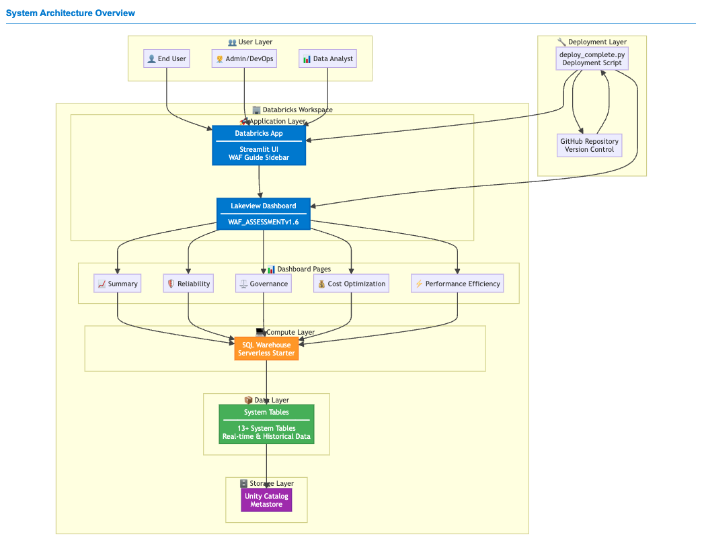
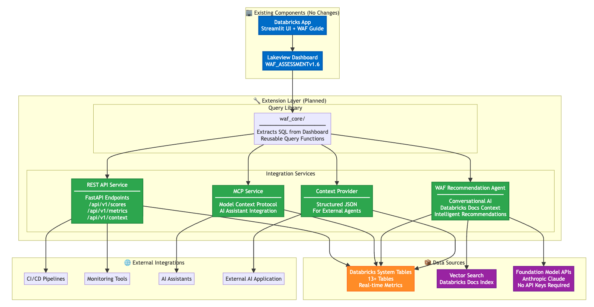
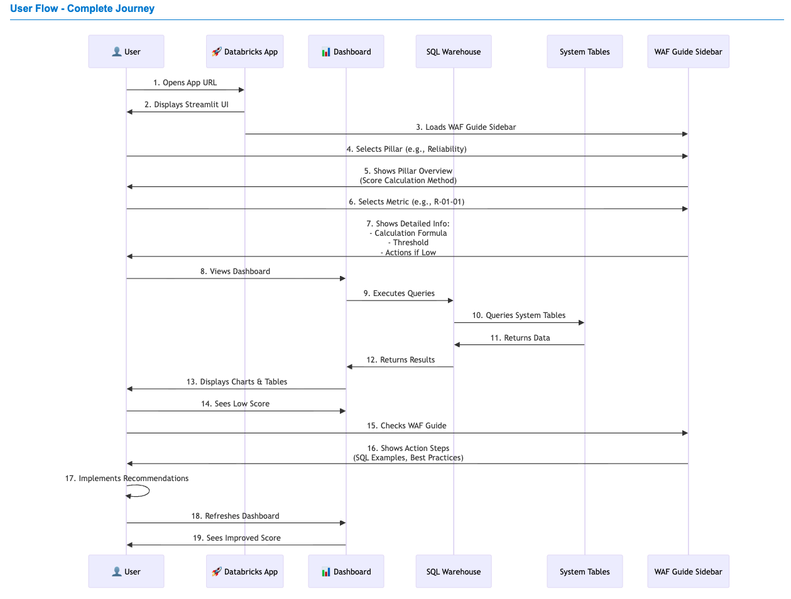
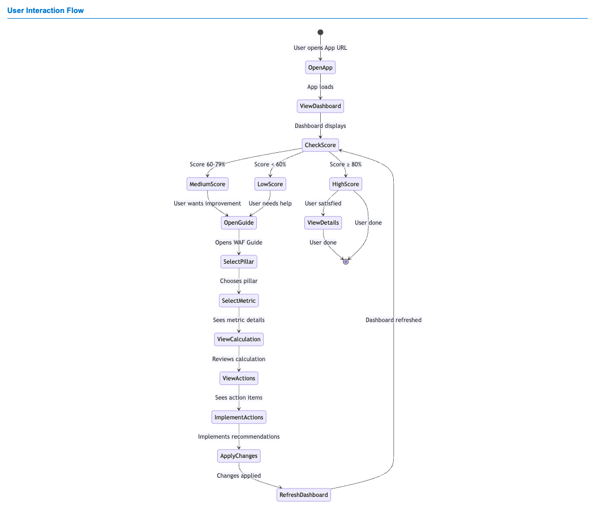

# Architecture

## System overview

{ .screenshot }

The WAF Light Tooling stack has three layers: a **data layer** (system tables → waf_cache), an **application layer** (Databricks App — the central hub that embeds the Lakeview dashboard and surfaces all functionality), and an **AI layer** (Genie Space).

---

## Component map

```
install.ipynb  (run once, in Databricks)
│
├── Cell 1    User sets CATALOG name
├── Cell 2    Setup: api_url, token, notebook_dir, greenfield checks
├── Cell 3    Ingest waf_controls_with_recommendations.csv → Delta
├── Cell 4    Create Genie Space (15 tables + instructions + SQL examples)
├── Cell 5    Deploy Lakeview dashboard (Genie embedded via overrideId)
├── Cell 6    Publish dashboard with SQL warehouse
├── Cell 7    Configure *.databricksapps.com embedding domain
├── Cell 8    Patch app.py in-memory (DASHBOARD_ID, INSTANCE_URL, WORKSPACE_ID)
├── Cell 9    Upload app files + create WAF Reload Job + deploy Databricks App
├── Cell 10   Grant SP permissions (waf_cache + system.*) + trigger initial reload
├── Cell 11   Installation summary (✅/❌ per step + direct links + access guide)
└── Cell 14   Finalize Genie (SP permission, app.yaml WAF_GENIE_URL, redeploy)
```

---

## Data flow

{ .screenshot }

```
Databricks System Tables
  system.billing.usage
  system.compute.clusters          WAF Reload Job (Databricks Job)
  system.compute.warehouses   ──►  waf_reload.py notebook
  system.access.audit              │
  system.query.history             │  writes to
  system.information_schema.tables │
  system.mlflow.experiments_latest ▼
                              {catalog}.waf_cache
                                waf_controls_c/p/g/r
                                waf_principal_percentage_*
                                waf_total_percentage_*
                                waf_total_percentage_across_pillars
                                waf_controls_with_recommendations
                                waf_recommendations_not_met (VIEW)
                                        │
                              ┌─────────┼──────────────────┐
                              ▼         ▼                   ▼
                     Lakeview        Databricks         Genie Space
                     Dashboard       App (App)          AI Assistant
```

---

## User flow

{ .screenshot }

---

## User interaction flow

{ .screenshot }

---

## Key technical decisions

| Decision | Reason |
|---|---|
| `uiSettings.overrideId` to link Genie | Not a public API — reverse-engineered from a manually-linked dashboard. `spaceId` and `PAGE_TYPE_GENIE` both fail silently. |
| `notebook_dir` from `ctx.notebookPath()` | `os.getcwd()` returns `/databricks/driver/` when the notebook is uploaded directly (not in a Repo). Context path is always correct. |
| `nbformat_minor: 5` + cell `id` fields | Databricks notebook loader requires this. Older format causes "Notebook failed to load". |
| Genie Space created before dashboard | `genie_space_id` must exist to embed in the dashboard template at creation time. |
| Initial reload triggered at install-end | Data loads in background so it's ready when the user first opens the app. |

---

## waf_cache schema

All WAF scores are cached in `{catalog}.waf_cache` and refreshed on each reload run. The schema is created by the installer.

| Table / View | Type | Description |
|---|---|---|
| `waf_controls_c` | Table | Cost Optimization control scores |
| `waf_controls_p` | Table | Performance Efficiency control scores |
| `waf_controls_g` | Table | Governance control scores |
| `waf_controls_r` | Table | Reliability control scores |
| `waf_principal_percentage_c` | Table | Cost scores per principal |
| `waf_principal_percentage_p` | Table | Performance scores per principal |
| `waf_principal_percentage_g` | Table | Governance scores per principal |
| `waf_principal_percentage_r` | Table | Reliability scores per principal |
| `waf_total_percentage_c` | Table | Total Cost score |
| `waf_total_percentage_p` | Table | Total Performance score |
| `waf_total_percentage_g` | Table | Total Governance score |
| `waf_total_percentage_r` | Table | Total Reliability score |
| `waf_total_percentage_across_pillars` | Table | Aggregated cross-pillar summary |
| `waf_controls_with_recommendations` | Table | Recommendations catalog (from CSV) |
| `waf_recommendations_not_met` | **View** | Failing controls joined with recommendations |

---

## Authentication

The installer uses the Databricks notebook context for all API calls — no API keys or personal tokens are hardcoded. The app runs as a Service Principal created by Databricks Apps, with permissions granted automatically in Cell 10.
