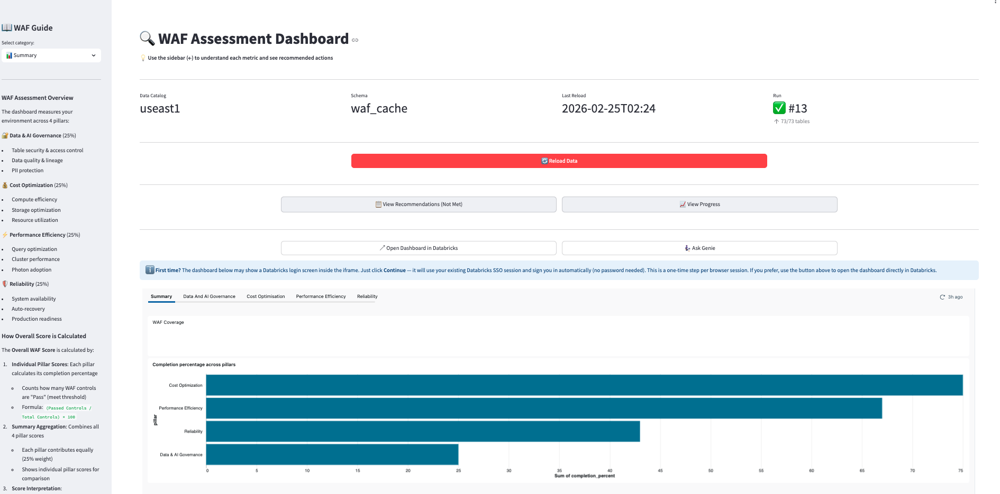
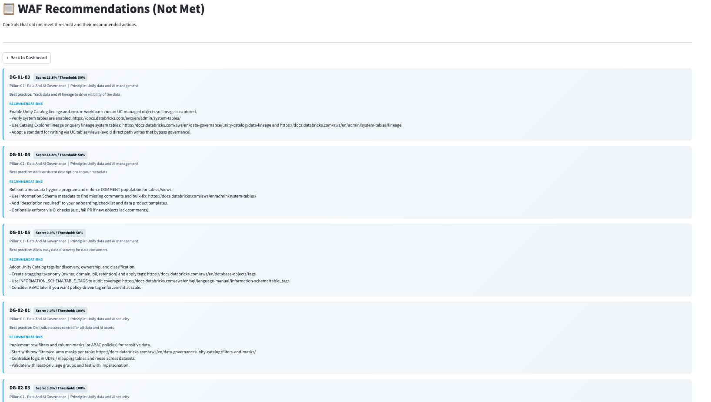
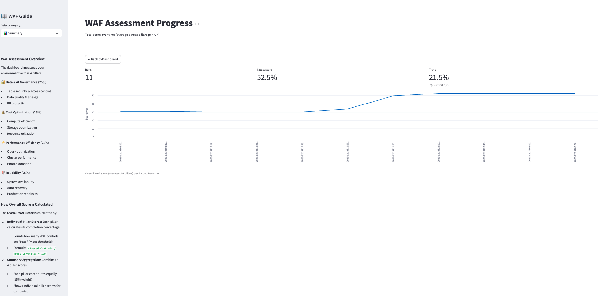

# Databricks App

The WAF Automation Tool is a **Databricks App** — the single URL your team needs. From here you get instant visibility across all 4 WAF pillars, the full history of how scores have changed over time, targeted recommendations for every failing control, and direct access to Genie for AI-powered follow-up questions. No need for users to navigate to the dashboard, Genie Space, or job separately.

{ .screenshot }

---

## The App as central hub

```
┌─────────────────────────────────────────────────────┐
│              WAF Automation Tool (Databricks App)    │
│                                                      │
│  ┌──────────────────────────────────────────────┐   │
│  │         Lakeview Dashboard (embedded)        │   │
│  │  Reliability · Governance · Cost · Perf      │   │
│  │  Summary · AI Assistant (Genie embedded)     │   │
│  └──────────────────────────────────────────────┘   │
│                                                      │
│  [Reload Data]  [Recommendations]  [Progress]        │
│  [Open in Databricks]  [Ask Genie]                   │
│                                                      │
│  ◀ WAF Guide sidebar                                 │
└─────────────────────────────────────────────────────┘
```

Everything the user needs is surfaced from a single URL — no need to share links to the dashboard, Genie Space, or job separately.

---

## Pages

### Dashboard (default view)

The main view embeds the full Lakeview dashboard. All pillar tabs (Reliability, Governance, Cost, Performance, Summary) and the AI Assistant tab (Genie) are accessible here without leaving the app.

**Toolbar actions:**

| Button | What it does |
|---|---|
| **Reload Data** | Triggers the WAF Reload Job — all WAF cache tables refresh in ~3–5 min |
| **Open in Databricks** | Opens the published dashboard directly in Databricks (new tab) |
| **Ask Genie** | Deep-links to the Genie Space for natural-language WAF queries |

---

### Recommendations (Not Met)

{ .screenshot }

Every failing WAF control — in one table. No need to open the dashboard or query tables manually.

| Column | Description |
|---|---|
| **WAF ID** | Control identifier (e.g. `RE-01-01`) |
| **Pillar** | Reliability / Governance / Cost / Performance |
| **Principle** | High-level WAF principle |
| **Best Practice** | Specific practice being evaluated |
| **Current Score** | Score at last reload |
| **Threshold** | Minimum passing score |
| **Gap** | How far below threshold |
| **Recommendation** | Exact remediation action |

{ .screenshot }

---

### Progress

{ .screenshot }

**View Progress** shows how your overall WAF score has evolved across every reload run — broken out by pillar — so you can visualise whether your remediations are actually moving the needle.

**How it works:** Each time the WAF Reload Job runs (whether triggered manually or on schedule), a new data point is written to `waf_cache`. View Progress reads all those historical data points and plots them on a timeline — one line per pillar (Reliability, Governance, Cost, Performance) plus an overall score.

**What to look for:**

| Pattern | What it means |
|---|---|
| Score rising after a reload | A remediation worked — the control now passes |
| Score flat across runs | No remediations applied, or system tables not yet populated |
| One pillar improving, others flat | Good — focused effort is visible |
| Score dropping | A new control was added or a previously passing control regressed |

**Use cases:**

- **Prove ROI** — show stakeholders a before/after chart after a sprint of remediation work
- **Track trends** — see whether governance or cost scores are improving faster than others
- **Catch regressions** — a sudden dip in a pillar signals something changed in the environment

!!! tip
    Run the reload job before and after a batch of remediations to capture clear before/after data points in the Progress chart.

---

## WAF Guide sidebar

Built-in reference documentation:

- **Score methodology** — how each metric is derived from system tables
- **Threshold guide** — what each band (Critical / At Risk / Progressing / Mature) means
- **Code examples** — SQL snippets for common WAF improvements
- **Control reference** — quick lookup for any WAF ID

---

## App URL

Printed at the end of `install.ipynb`:

```
https://<workspace>-waf-automation-tool.databricksapps.com
```

This is the **only URL users need to bookmark**. The dashboard, Genie Space, and reload job are all accessible from here.

!!! warning "Grant App access before sharing"
    Users need **CAN USE** on the app before the URL works for them.
    See [Grant Access — Step B](../installation/grant-access.md#step-b-grant-app-access).
