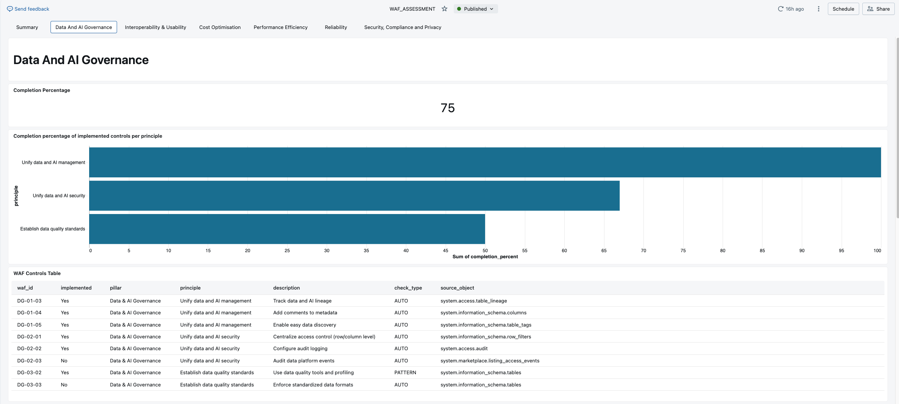

# Lakeview Dashboard

The WAF Assessment Dashboard is a Databricks Lakeview dashboard automatically deployed and published by the installer. It provides real-time WAF scores across four pillars and includes an embedded Genie AI assistant tab.

{ .screenshot }

---

## Pillar tabs

The dashboard has one tab per pillar plus a Summary:

| Tab | Pillar | What it measures |
|---|---|---|
| :shield: **Reliability** | Reliability | System resilience, backup coverage, multi-region posture |
| :scales: **Governance** | Governance | Data governance, access controls, Unity Catalog adoption |
| :moneybag: **Cost Optimization** | Cost | Compute efficiency, idle resources, cost per DBU |
| :zap: **Performance Efficiency** | Performance | Query performance, warehouse utilization, serverless adoption |
| :bar_chart: **Summary** | All pillars | Aggregated scores with completion-percentage bar chart |
| :robot: **AI Assistant** | — | Genie Space embedded directly in the dashboard |

---

## Score bands

Each control is scored 0–100 and grouped into bands:

| Band | Score range | Meaning |
|---|---|---|
| :red_circle: **Critical** | 0–40 | Significant gaps — immediate attention needed |
| :orange_circle: **At Risk** | 41–60 | Below threshold — improvement plan recommended |
| :yellow_circle: **Progressing** | 61–80 | On track — keep iterating |
| :green_circle: **Mature** | 81–100 | WAF-aligned — maintain and monitor |

---

## Data sources

The dashboard reads from `{catalog}.waf_cache` tables, which are populated by the WAF Reload Job from these system tables:

- `system.billing.usage` — cost and DBU usage
- `system.compute.clusters` — cluster configurations and policies
- `system.compute.warehouses` — warehouse usage patterns
- `system.access.audit` — access and permission events
- `system.query.history` — query performance metrics
- `system.information_schema.tables` — table metadata and governance signals
- `system.mlflow.experiments_latest` — ML experiment tracking

---

## AI Assistant tab

The **AI Assistant** tab is the Genie Space embedded directly inside the dashboard via `uiSettings.overrideId`. No manual linking is required — it is configured automatically during install.

See [Genie AI Space](genie.md) for full details on what the AI assistant can do.

---

## Refreshing data

Dashboard data reflects the last time the WAF Reload Job ran. To refresh:

- Click **Reload Data** in the Streamlit App, or
- Run the WAF Reload Job manually from the Databricks Jobs UI

The job takes ~3–5 minutes to complete. The dashboard updates automatically once new data is written to `waf_cache`.

---

## Embedding

The dashboard is embedded inside the Streamlit App via an `<iframe>`. The installer automatically configures `*.databricksapps.com` as an allowed embedding domain.

!!! warning "Workspace-level embedding must be enabled by an admin"
    If you see "Embedding dashboards is not available on this domain", a workspace admin must first enable embedding in **Admin Console → Advanced**. See [Troubleshooting](../troubleshooting.md#embedding-issues) for details.
