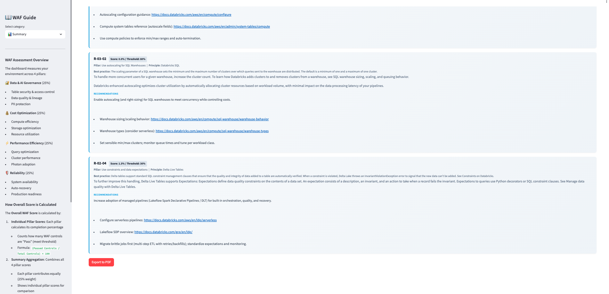

---
hide:
  - navigation
  - toc
---

Databricks WAF Light Tooling

Automated <strong>Well-Architected Framework</strong> assessments for Databricks Lakehouses. 
One notebook install · Real-time scoring · Actionable recommendations · AI-powered queries.

[Get Started :material-arrow-right:](installation/quickstart.md){ .md-button .md-button--primary }
[View on GitHub :fontawesome-brands-github:](https://github.com/AbhiDatabricks/Databricks-WAF-Light-Tooling){ .md-button }

---

## What you get in one notebook run

-   :material-view-dashboard: &nbsp;**Lakeview Dashboard**

    ---

    Real-time WAF scores across 4 pillars — Reliability, Governance, Cost, Performance — plus an embedded Genie AI tab.

    [:octicons-arrow-right-24: Dashboard features](features/dashboard.md)

-   :material-application: &nbsp;**Streamlit App**

    ---

    Interactive app with embedded dashboard, one-click data reload, Recommendations page, Progress trend chart, and a full WAF Guide sidebar.

    [:octicons-arrow-right-24: App features](features/app.md)

-   :material-robot: &nbsp;**Genie AI Space**

    ---

    AI assistant pre-loaded with all 15 WAF tables. Ask *"Which controls are failing and why?"* in plain English — linked directly inside the dashboard.

    [:octicons-arrow-right-24: Genie features](features/genie.md)

-   :material-refresh: &nbsp;**WAF Reload Job**

    ---

    Background Databricks Job that refreshes all WAF cache tables. Triggered automatically at install-end; invokable on demand from the app.

    [:octicons-arrow-right-24: Architecture](architecture.md)

---

## See it in action

=== "Dashboard"

    { .screenshot }

    *Main app view — embedded Lakeview dashboard with WAF pillar scores and an AI Assistant tab.*

=== "Recommendations"

    { .screenshot }

    *Every failing control with its WAF ID, score vs threshold gap, and the exact fix needed.*

    { .screenshot }

=== "Progress"

    { .screenshot }

    *Score trend chart across all reload runs — track how your Lakehouse improves over time.*

=== "Genie"

    { .screenshot }

    *Genie AI Space embedded in the dashboard — ask WAF questions in natural language.*

---

## WAF Pillars covered

| Pillar | What it measures |
|---|---|
| :shield: **Reliability** | System resilience, backup coverage, recovery posture |
| :scales: **Governance** | Data governance, access controls, compliance posture |
| :moneybag: **Cost Optimization** | Compute efficiency, idle resources, right-sizing |
| :zap: **Performance Efficiency** | Query performance, warehouse utilization, serverless adoption |

---

## Why not a custom dashboard?

| | Custom dashboards | WAF Light Tooling |
|---|---|---|
| Setup time | Days–weeks | **~10 minutes** |
| Maintenance | Manual | **Auto-updated** |
| Consistency | Varies per customer | **Standardized WAF scoring** |
| AI assistant | Build your own | **Genie Space included** |
| Recommendations | Manual analysis | **Automated, per-control** |

---

## Ready to install?

[Quick Start :material-arrow-right:](installation/quickstart.md){ .md-button .md-button--primary }
[Check required permissions](installation/permissions.md){ .md-button }
